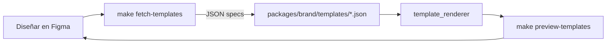

# Plantillas de overlay — Bot Estiv

Las plantillas viven en **Figma** y se sincronizan al código via `make fetch-templates`. El renderer (`apps/api/src/bot_estiv/tools/template_renderer.py`) las consume para componer la pieza final.

Si un JSON no existe, el renderer cae a la versión BUILTIN hardcodeada en el mismo archivo. Esto permite iterar en Figma sin romper producción.

## Convenciones del archivo Figma

### 1. File

- Crear un archivo Figma nuevo llamado **"Bot Estiv — Overlays"**.
- Página única (no subpáginas — el sync recorre la primera).
- Todos los frames de 1080×1350 (o el formato final deseado).

### 2. Naming de frames

Cada plantilla es un **frame** de primer nivel con nombre `template:<name>`. Ejemplos:

```
template:editorial_hero
template:minimal_stamp
template:cover_hero
template:split_60_40
template:spec_card
```

El `<name>` es el identificador que usa el código (`content_designer._pick_template`).

### 3. Naming de capas dentro del frame

El sync recorre las capas del frame y las clasifica por prefijo:

#### Slots de contenido

| Nombre de capa | Tipo en Figma | Función |
|---|---|---|
| `slot:image` | Frame/Rect vacío | Dónde va la foto/imagen de fondo |
| `slot:logo` | Frame vacío | Donde el renderer coloca el logo Gardens Wood (contain) |
| `slot:title` | TEXT | Título principal (Playfair) |
| `slot:subtitle` | TEXT | Bajada (Montserrat Medium) |
| `slot:pillar_tag` | TEXT | Tag del pilar (small caps Montserrat SemiBold) |

Para los slots de TEXT, la **descripción del layer** (click derecho → "Add description") puede opcionalmente pasar overrides:

```
font=heading_bold size=68 color=#F5F1EA align=left upper=false track=0.0 maxLines=2 line=1.08
```

Los nombres de font válidos son: `heading`, `heading_bold`, `body`, `body_medium`, `body_semibold`, `body_bold`.

Si no hay description, el renderer usa la tipografía / color / tamaño que vean en Figma.

#### Decoraciones

| Nombre de capa | Tipo | Resultado |
|---|---|---|
| `deco:rect` | Rect | Rectángulo sólido con el fill + opacity del layer |
| `deco:hairline` | Rect fino | Línea delgada (fill + opacity) |
| `deco:gradient_v` | Rect | Gradiente vertical. Color = fill; `dir=bottom-up` o `top-down` en description |
| `deco:corner_brackets` | Rect (solo para bbox) | Corchetes en las 4 esquinas. Params en description: `weight=2 corner=28` |

Tip: mantenete ≤6 decoraciones por plantilla. Menos es más.

## Workflow



1. Diseñás / modificás el frame en Figma.
2. Corres `make fetch-templates` desde la raíz del repo.
3. El renderer empieza a usar la nueva versión automáticamente.
4. Para ver el resultado sin llamar a Gemini, `make preview-templates` genera los PNG en `apps/api/preview_templates/`.

## Credenciales (una vez)

En tu `.env`:

```
FIGMA_ACCESS_TOKEN=figd_...        # https://www.figma.com/developers/api#access-tokens
FIGMA_TEMPLATES_FILE_KEY=abc123xyz # parte de la URL entre /file/ o /design/ y el nombre
```

El token es de lectura; no expone riesgo.

## Diseñar una plantilla nueva — guía rápida

1. Duplica una plantilla existente como base.
2. Renombra el frame a `template:<nuevo_nombre>`.
3. Ajustá slots y decoraciones respetando la paleta de marca:
   - Gris carbón `#36454F`, blanco hueso `#F5F5DC`, quebracho `#654321`
   - Verde eucalipto `#5F8575`, naranja fuego `#E59500` (acento)
4. Tipografías:
   - Títulos: Playfair Display Bold
   - Bajadas: Montserrat Medium
   - Labels/tags: Montserrat SemiBold, UPPERCASE con letter-spacing alto
5. Dejá **safe zones** de 60 px en cada lado (márgenes).
6. El **logo** idealmente abajo a la derecha, mínimo 120×50 px para que se lea.
7. `make fetch-templates` + `make preview-templates` → evaluar.
8. Iterar hasta aprobar.

## Agregar la plantilla al roteo narrativo

Si querés que una plantilla se elija automáticamente para una posición del carrusel, editar `content_designer._ROLE_TEMPLATE_BY_INDEX` en `apps/api/src/bot_estiv/agents/content_designer.py`:

```python
_ROLE_TEMPLATE_BY_INDEX = {
    1: "cover_hero",
    2: "minimal_stamp",
    3: "editorial_hero",
    4: "split_60_40",
    5: "spec_card",
}
```

## BrandGuardian

Toda plantilla nueva debe pasar `brand_guardian.validate_rendered_template`:
- Contraste del título ≥ 4.5:1 WCAG AA
- Altura del bloque de título ≥ 4% de la imagen
- Zona del logo no puede ser blanco/negro uniforme
- Paleta dominante cercana a la marca

Si el Guardian warneaba algo, ajustar la plantilla antes de usarla en producción.
